========
Починаємо працювати з ThatQuiz
========
ThatQuiz є безкоштовним сервісом для вчителів щоб проводити тестування як в класах, так і вдома. Учням можуть бути запропоновані питання з вибором правильної відповіді або на встановлення відповідності. Всі оцінки негайно повідомляються учням. Вчителі отримують повний перелік результатів випробувань для всіх класів, включаючи і неправильні відповіді.

Як розпочати негайно
--------------------
Знайдіть у веб-оглядачі за допомогою улюбленої пошукової системи "thatquiz" або перейдіть за адресою https://www.thatquiz.org

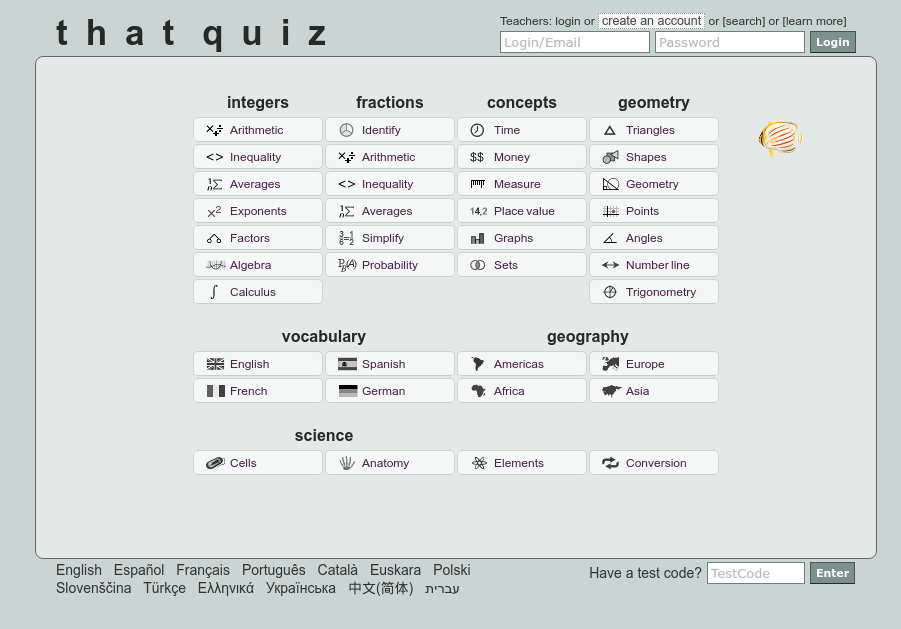
   
Ви можете обрати потрібну мову з меню, яке розташоване нижче переліку тестів.
Якщо ви бажаєте відразу мати українську мову, тоді варто заходити за посиланням: https://www.thatquiz.org/uk/

Реєстрація вчителя
------------------
ThatQuiz дає змогу працювати без жодної реєстрації як вчителя, так і учнів - у так званому режимі "практики", коли користувач самостійно обирає потрібний тест із наявних у Головному меню тестів, але у цьому режимі оцінювання не проводиться і оцінки не обліковуються. Реєстрація вчителя дає йому змогу:
- створювати клас;

- призначати тести;

- переглядати оцінки та протоколи тестування;

- розробляти власні тести;

- використовувати тести, розроблені іншими вчителями у ThatQuiz;

- поширювати власноруч розроблені тести серед інших вчителів;

- сповіщати батьків про оцінки учнів.

Реєстрація є безкоштовною і досить простою. Для реєстрації необхідно перейти за посиланням ``реєстрація``:

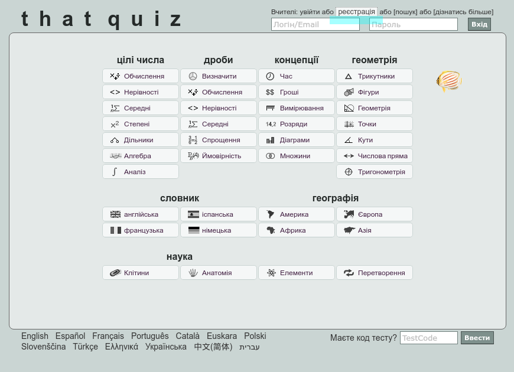

У вікні реєстрації запишіть необіхідні відомості про себе, адресу чинної електронної поштової скриньки та пароль для входу на сайт ThatQuiz. З метою запобігання автоматичним реєстраціям онлайн-ботів використовується CAPTCHA - потрібно ввести текст із зображення. Не забудьте погодитись на Умови надання послуг сайтом:

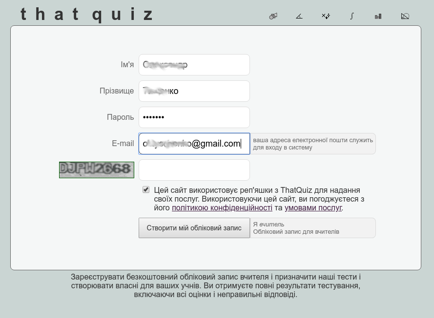

Після реєстрації та входу ви потрапляєте до Сторінки керування "ThatQuiz для вчителів", де вам буде запропонавано короткі настанови та поради для роботи з системою і меню з переліком доступних дій:
- меню Класи;

- меню Тести;

- меню Інші тести;

- меню Адміністратора.

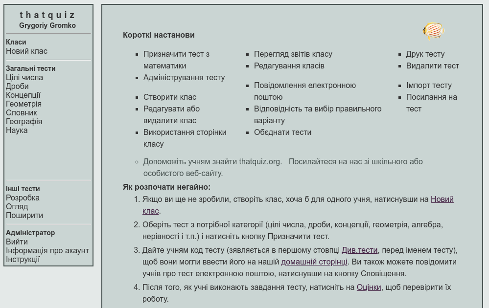

Створення класу
---------------
Клас в ThatQuiz - група користувачів, яким надаються відповідні спільні тестові завдання і які мають спільний "електронний журнал" для оцінювання. Для створення класу (навіть для одного учня) натисніть ``Новий клас`` в меню Класи.

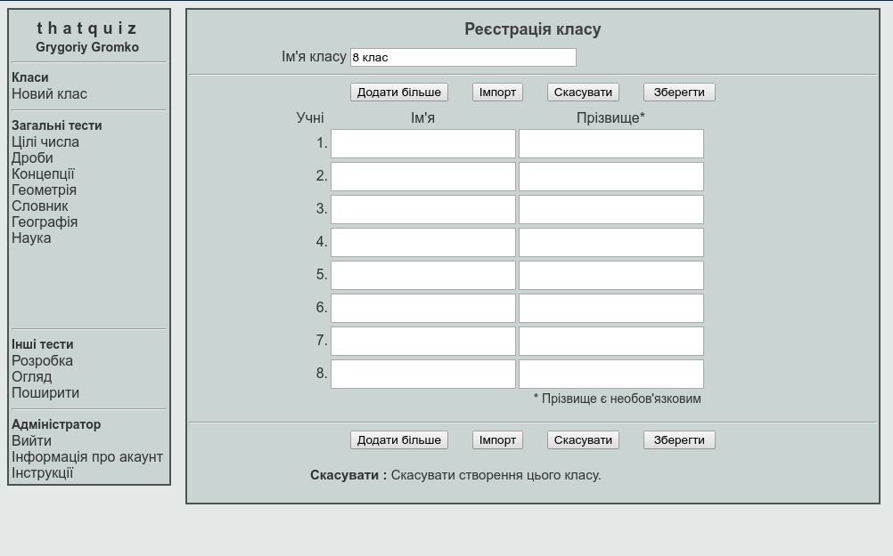
   
Запишіть назву класу та занесіть відомості про учнів. Якщо ви маєте готовий список учнів класу, то можете скористатися функцією ``Імпорт``, зкопіювавши список з текстового редактора і вставивши у вікно імпокту:

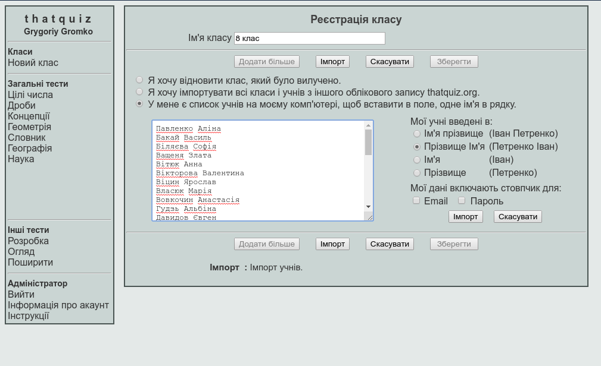
   
Обравши потрібне представлення даних учня та натиснувши кнопку ``Імпорт``, ви отримаєте готовий список учнів класу, який необхідно зберегти, натиснувши кнопу ``Зберегти``

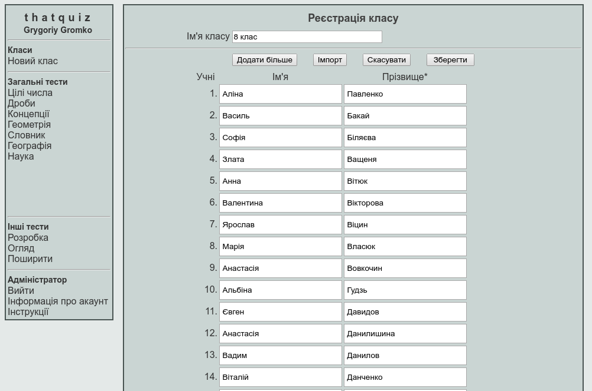
   
Звичайно, ви можете створити список і "вручну", записавши небхідні відомості про учнів.
Ви завжди можете додати учня до списку, скориставшись кнопкою ``Додати більше``. Для вилучення учні зі списку необхідно видалити всі дані про нього, залишивши порожній рядок, після збереження списку, цей рядок буде вилучено.

Призначення тесту
-----------------
Натисніть потрібну тестову групу в Єдиному меню тестів (математичних - цілі числа, дроби, концепції, геометрія, алгебра, нерівності і т.п.). Налаштуйте параметри тестування за бажанням. Виберіть клас для проведення тесту в меню класів і натисніть кнопку ``Призначення тесту``, щоб закінчити.
Параметри тестів:
1. Кількість - це кількість завдань у тесті.

2. Рівень - ступінь складності тесту, від легкого (малі числа) до складного (великі числа).

3. Таймер - час за який учні повинні пройти тест.

4. Порядок- показує, як питання пропонуються кожному учню. Учні можуть отримувати питання у випадковому або фіксованому порядку.

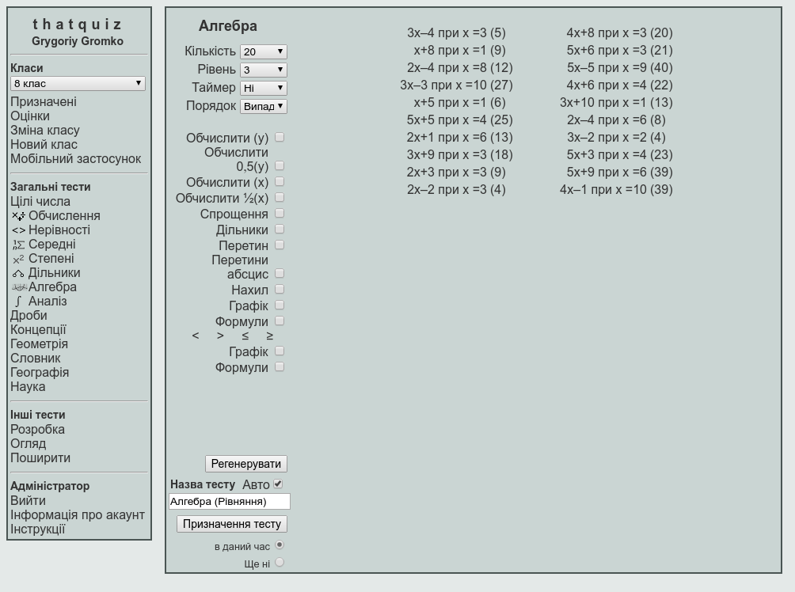
   
Кнопка ``Регенерувати`` змінює пропоновані завдання. При призначенні тестів вчителем учням пропонується набір наперед визначених завдань - усім однакові, але  можливо у різному порядку. Це робиться для того, щоб можна було адекватно оцінити знання та навички учнів.
Можна змінити назву тесту або залишити її запропонованою, та визначити коли подавати тест для виконання учнями.
Створені тести можна завжди переглянути у розділі ``Призначені`

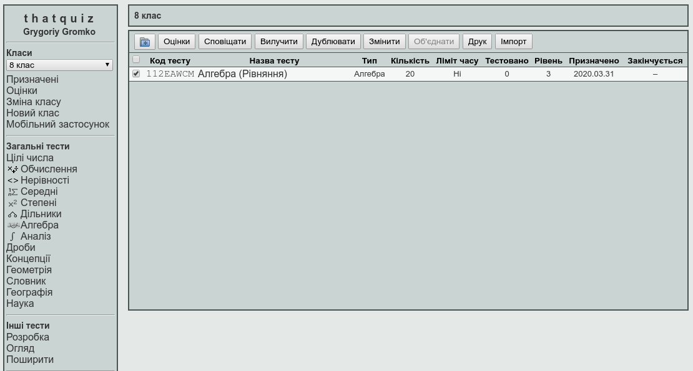

Код тесту
---------
Код тесту відображається в першому стовпчику таблиці тестів при натисканні на ``Призначені``. Він складається з 8 символів (цифр і букв, наприклад 112EWACM). Цей код використовується для організації доступу учнів до призначених для них завдань. Кожен тест має свій унікальний код. При роботі в класі можна запропонувати учням ввести код в поле Код тесту на домашній сторінці ThatQuiz і натиснути клавішу Enter щоб почати тестування - кдо можна записати на класній дошці, часто це найпростіший і найбільш доречний спосіб.
ThatQuiz  надає можливість повідомити учнів про тест електронною поштою, натиснувши на кнопку ``Сповіщення``.

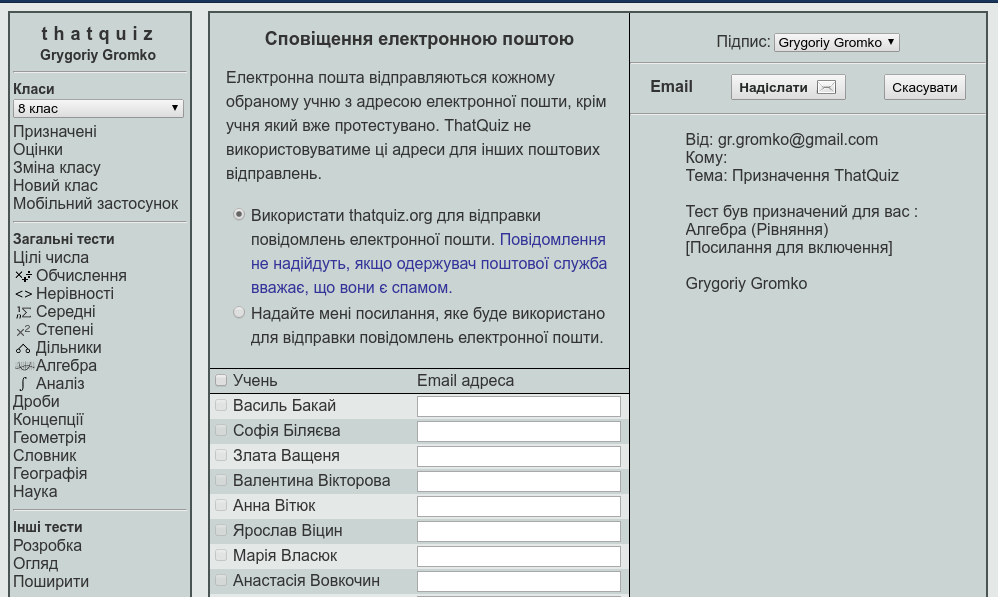
   
Адреси електронної пошти учнів (батьків, чи осіб, які їх замінюють для дітей, які не досягли 14 років) можуть бути введені при реєстрації класу, при зміні списку учнів або при самому сповіщенні (адреси потрібно вводити всього лише один раз, вони запам'ятовуються автоматично).
Крім входу за допомогою тестового коду, можна здійснити вхід за допомогою посилання на тест або вбудувавши тест у код сайту чи блогу.

Виконання тесту учнями
-------------------------------
Щоб почати тестування, учні повинні або увійти через тестовий код, або через посилання на їх Головній сторінці класу, або через повідомлення електронною поштою.
Відразу після входу учень повинен обрати свої прізвище та ім'я зі списку класу. Для учнів реєстрація непотрібна.

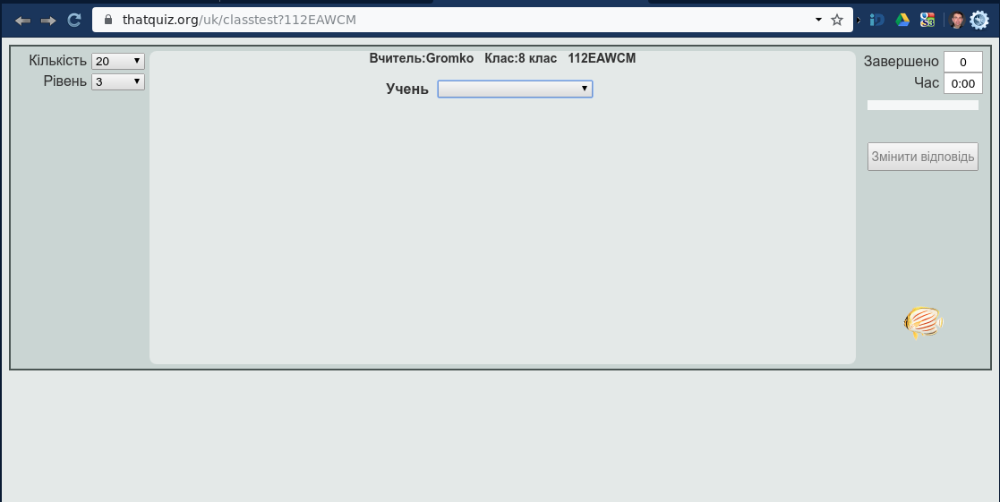
   
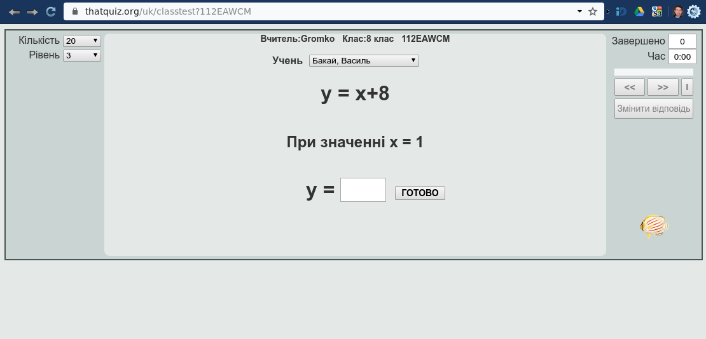
   
До закінчення тесту учень завжди може повернутися до будь-якого з попередніх завдань і виправити відповідь. Натиснувши кнопку ``Кінець``, учень надсилає відповіді вчителю.

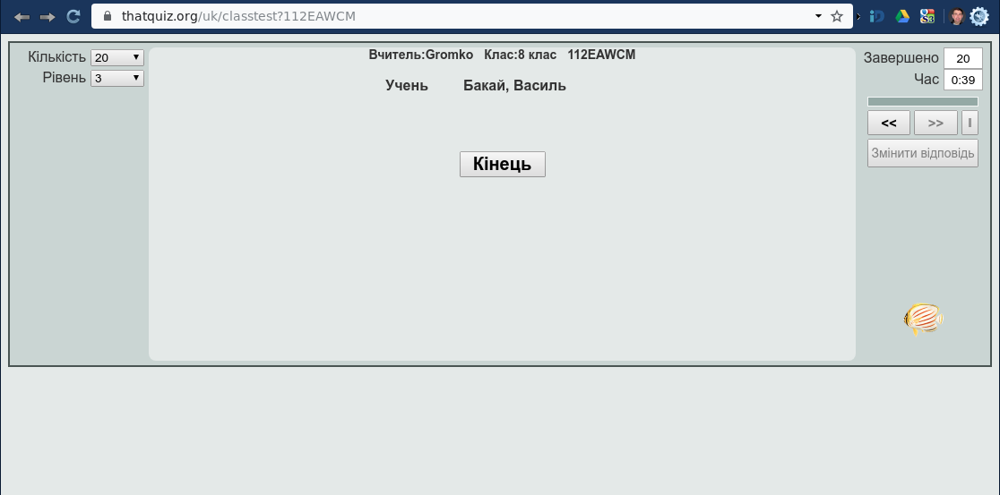
   
По закінченню тесту учню надається інформація про хід його виконання.

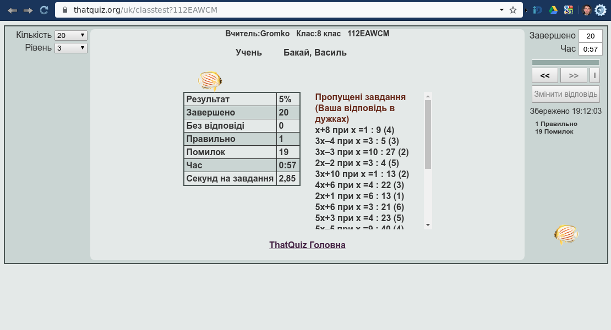
   
Перегляд результатів тестування
-------------------------------
Вчитель у будь-який момент може переглянути результати виконання тесту учнями, натиснувши кнопку ``Оцінки``

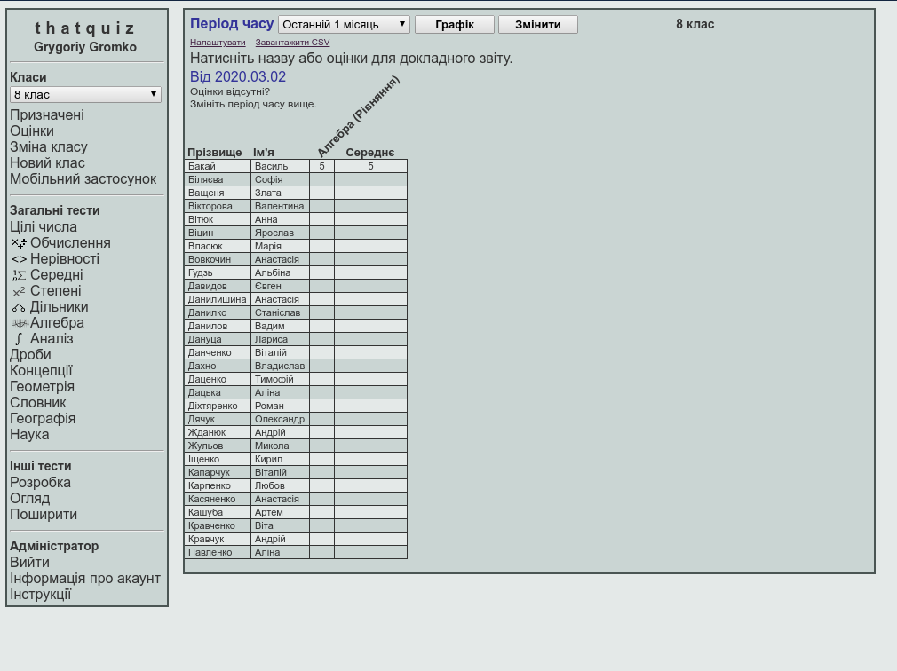

Обравши конкретного учня зі списку можна отримати детальний протокол тестування, у якому вказано час виконання тесту, допущені учнем помилки та оцінку за тест.

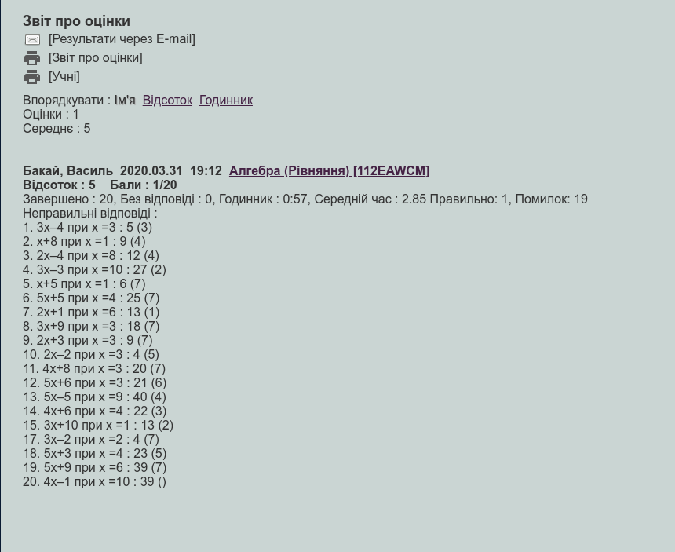
   
 ThatQuiz дає можливість вчителю обирати власну або пропоновану шкалу оцінювання (1-5, 1-7, 1-10, 1-20, 1-100), яку можна застосовувати як для окремих класів, так і для усіх класів вчителя.
 
 
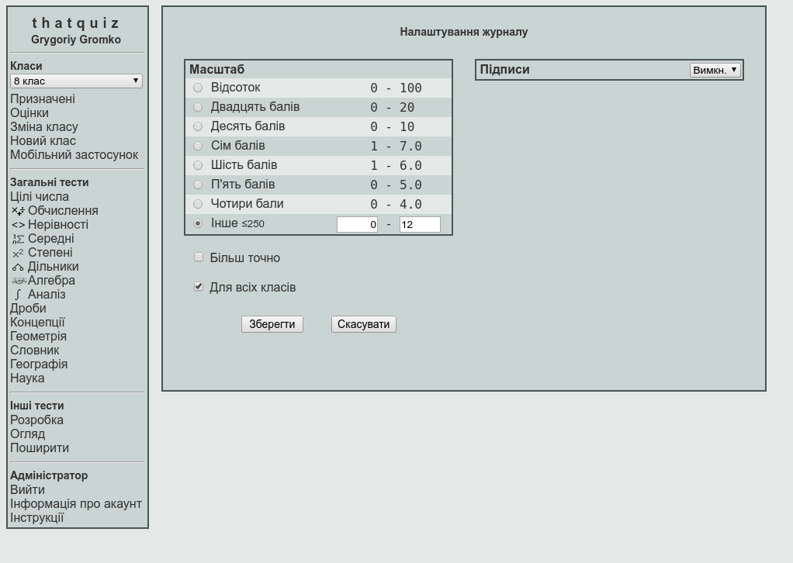

