================
Створення тестів
================

Звичайно, що пропоновані на ThatQuiz тести не можуть задовольнити усіх
вимог вчителів - різні навчальні плани, різні навчальні програми, різні
вчителі та різні учні, все це потребує урізноманітнення педагогічних
технологій та методичних прийомів при опрацьовуванні навчального
матеріалу.

Якщо ви не знайшли потрібного тесту або наявні тести вас не задовольняють,
отже настав час для створення власних тестів. Повірте, це зовсім не
складно.

Типи тестів ThatQuiz
--------------------
Система використовує три основних тести:

- тести на вибір правильної відповіді;

- тести на встановлення відповідності;

- слайдові тести, яко можуть поєднувати різні види тестів з
вищеназваних.

Тести на відповідність та вибір правильної відповіді
----------------------------------------------------
| Тест на відповідність вимагає встановлення зв’язків між елементами
  двох категорій - учень натискує елемент з першої категорії, потім
  відповідний йому елемент з другої категорії, між ними з’являється
  «зв’язок» у вигляді стрілки.

Для створення тесту на відповідність необхідно в меню ``Інші`` обрати
``Розробка`` і натиснути кнопку ``Відповідність``

|image0|

|image1|

У вікні конструктора тестів необхідно заповнити рядки першої і другої
категорій, розташувавши їх у правильному порядку. У кожній категорії ви
можете використати не більше 10 елементів, порожні рядки буде вилучено з
тесту. Щоб створити наступну групу тесту на відповідність натисніть
кнопку ``Група>>``.

|image2|

Створивши тест, ви повинні зберегти його натиснувши кнопку ``Зберегти``.
Якщо немає потреби у збереженні тесту - натискуєте ``Скасувати``.

Переглянути створений тест можна у меню ``Розробка``, позначивши тест
«галочкою» та натиснувши кнопrу ``Перегляд``

|image3|

|image4|

Після створення ви можете його призначити або негайно або у будь-який
потрібний час, натиснувши кнопку ``Призначити``

Тести на вибір правильної вівдповіді
------------------------------------
| Тести на вибір правильної відповіді можуть мати як одну правильну
  відповідь, так і декілька правильних відповідей, також надається
  можливість надати розгорнуту відповідь («есе»), яка перевіряється
  вчителем (не автоматично!)

Щоб створити тест на вибір правильної відповіді обираємо в меню ``Інші``
пункт ``Розробка`` та натискуємо кнопку ``Питання``.

|image5|

|image6|

Спочатку запишемо назву тесту, вона повинна бути зрозумілою та
інформативною.

У першому стопчику записуємо питання, у стовпчику ``Правильна відповідь``
- правильну відповідь, у інших стовпчиках - неправильні варіанти (2-4).
Правильна відповідь завжди повинна бути першою, при проходженні
тестування система розмістить варіанти відповідей у випадковому порядку.

|image7|

Тести з декількома правильними відповідями
------------------------------------------
Система дозволяє використовувати у варіантах відповіді декілька
варіантів. Для цього натисніть ``Розширити``.

|image8|

Ви можете позначити усі варіанти з правильними відповідями, встановлюючи
напроти них позначку.

|image9|

При використанні декількох правильних варіантів перемкніть кнопки виду
питання (кругла - одна відповідь, квадратна з позначкою - декілька
відповідей).

В тестах ви можете використовувати графічні зображення та відеоролики.
Для цього необхідно натиснути кнопку з літерої ``і``.

|image10|

Оберіть потрібний файл -для нього буде доступний перегляд.

|image11|

Щоб використати зображення у тесті - натисніть ``Прийняти``. Кнопка
``Зміна`` дозволяє змінити наявне зображення. Якщо в питанні тесту
використовується зображення, про це інформує «мініатюра» біля кнопки
``Перегляд``, яка знаходиться на місці літери ``і``.

|image12|

Кнопка ``Перегляд`` дозволяє переглянути, якм чином буде виглядати
створюване питання, без перегляду усього тесту.

Після запису усіх питань та відповідей на них, натискуємо кнопку
``Зберегти``.

|image13|

Якщо ваш тест має більше 10 питань, ви можете «опублікувати» його,
зробивши доступним для інших вчителів.

Зверніть увагу, що при перегляді публічних тестів, ви зможете бачити
лише тести з вашого мовного розділу, тобто використовуючи українську
мову ви не зможете переглядати тести, створені англійською мово. Разом з
тим ви можете змінити мову систем на стартовій сторінці на англійську
(для прикладу), переглянути доступні тести та імпортувати їх, зберігши у
своєму обліковому записі вчителя, після цього вони будуть доступні,
навіть коли ви будете працювати з україномовним варіантом системи.

Математичні та хімічні формули
------------------------------
За потреби ви можете стврювати прості математичні та хімічні формули:

===================== =====================================
Введений текст        Відображуваний текст
x^5                   x\ :sup:`5`
a_1                   a\ :sub:`1`
x^2y^3                x\ :sup:`2`\ y\ :sup:`3`
x^[2y^3]              x\ :sup:`2y3`
x^-2k-1               x\ :sup:`-2`\ k-1
x^(a+b)               x\ :sup:`a+b`
x^[(a+b)]             x\ :sup:`(a+b)`
U(C_8H_8)_2           U(C\ :sub:`8`\ H\ :sub:`8`)\ :sub:`2`
[[4F2A]]_16           4f2a\ :sub:`16`
""Don Quixote""       *Don Quixote*
Lorem ""ipsum"" dolor Lorem *ipsum* dolor
===================== =====================================

Складніші формули варто створювати в онлайн-редакторах та вставляти їх у
питання тесту як зображення

Важливо памятати, що тести повинні бути призначені після того, як вони
будуть створені. Призначення тесту створює копію з тестовим кодом для
кожного окремого класу. Призначені копії незалежні від оригінального
тесту який ви розробили. Видалення або зміна копій не впливає на нього.
Якщо в подальшому ви вносите зміни в тест, ви повинні призначити його
знову, щоб зміни стали доступними для учнів.

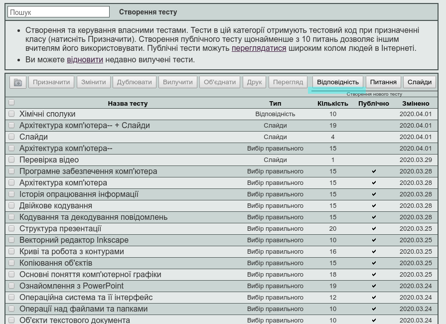
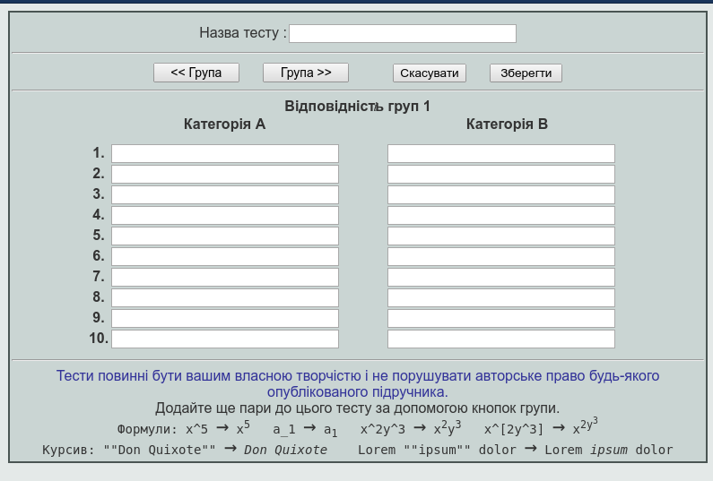
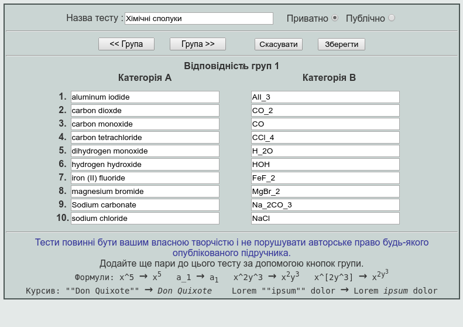
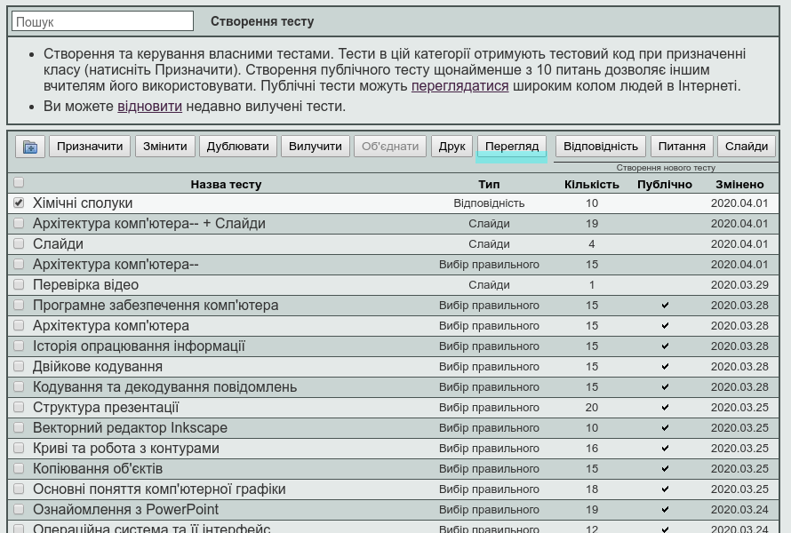
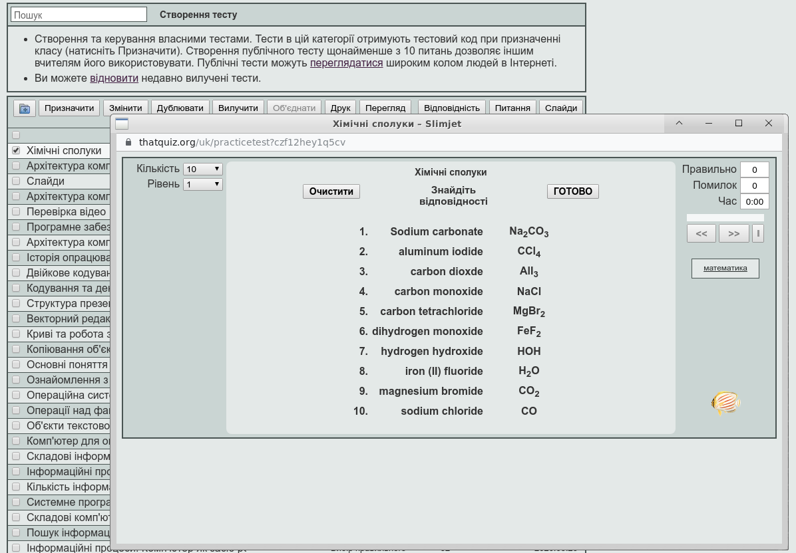
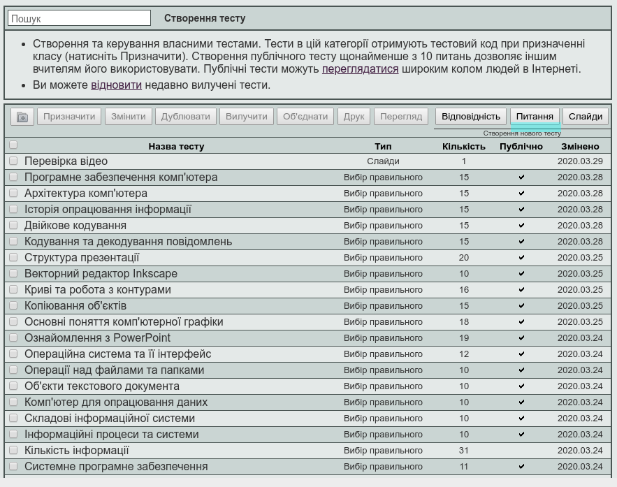
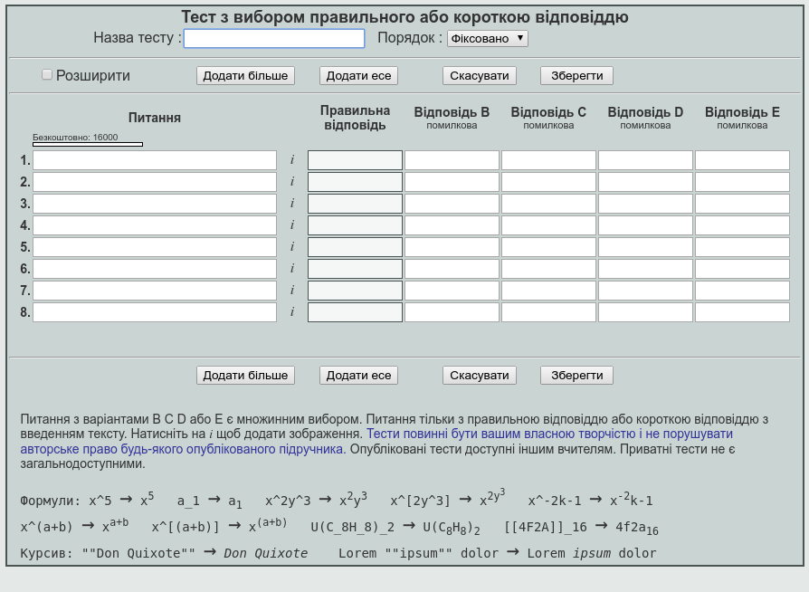
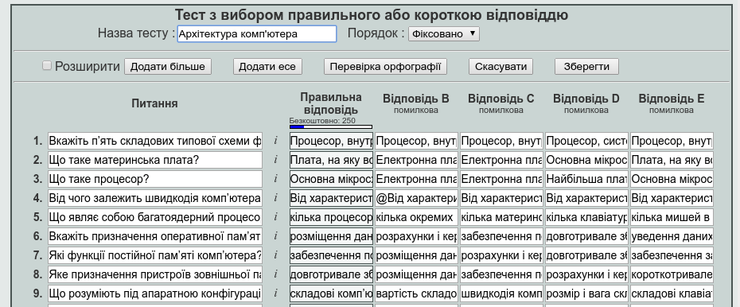
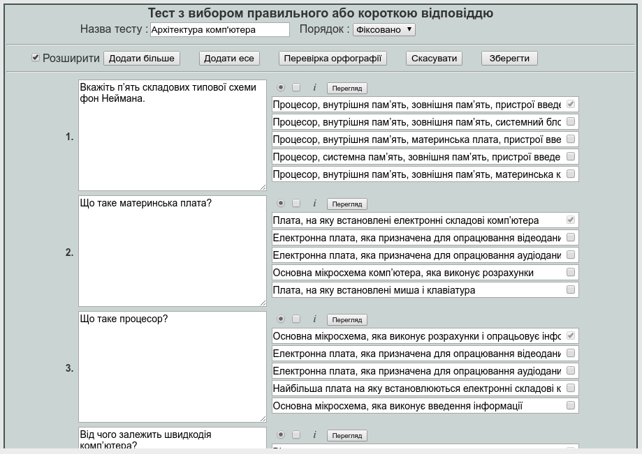
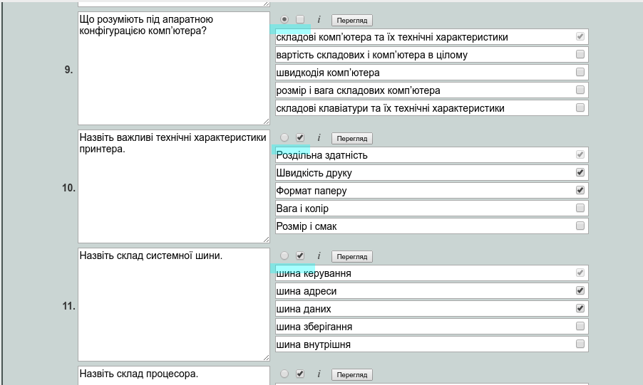
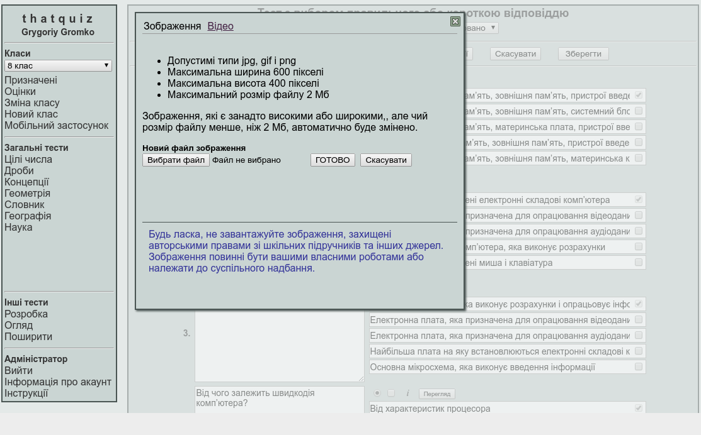
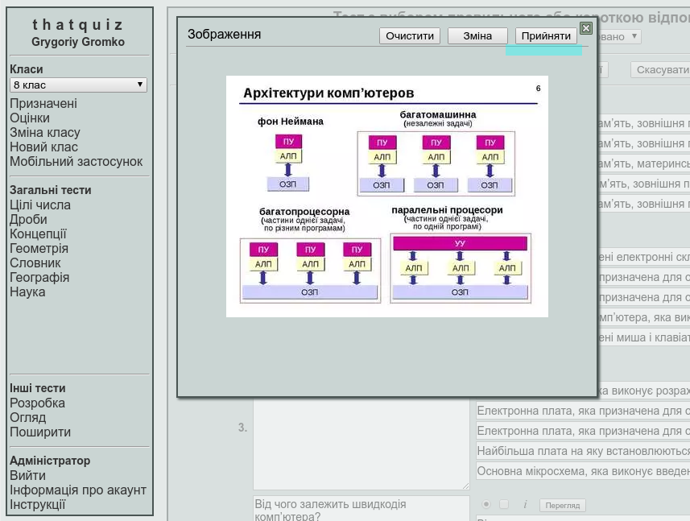
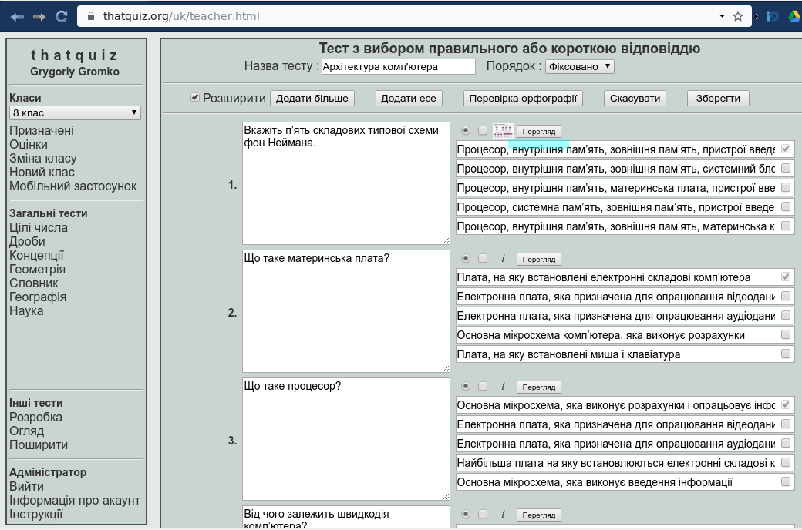
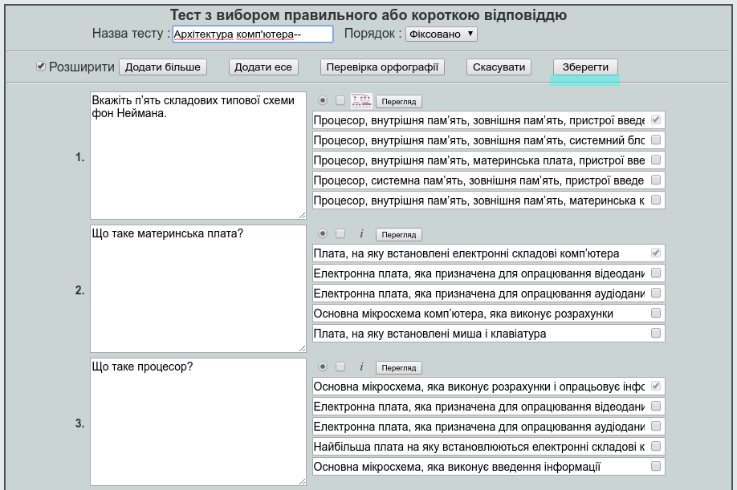
