==============
Слайдові тести
==============
**Робота зі слайдами**

ThatQuiz пропонує три типи тестів:

- на відповідність певних категорій;

- вибір правильного варіанту (варіантів) відповіді;

- слайдові тести.

Слайдові тести оперують графічними елементами і можуть бути використані
при створенні тестів з вибором правильного елементу, із вписуванням
відповіді та з пошуком відповідності шляхом перетягування відповідей на
необхідне місце слайду.

Створення слайдів є не складним, його не важко освоїти і це пропонує
користувачу більшу гнучкість, ніж більш прості способи множинного вибору
та відповідності для створення тесту. Використовуючи набір доступних
інструментів, ви можете малювати геометричні фігури, графіки та створити
тести на ідентифікацію елементів.

Для створення слайдових тестів необхідно натиснути в меню Розробка
кнопку «Слайди»

|tq2-1|

Інтерфейс засобу створення слайдів є дуже схожим на інтерфейс простого
графічного редактора.

|image1|

| На панелі, що розміщена ліворуч є два типи інструментів. Перші шість
  кнопок (переміщення, зміна розміру, вибір, заповнення, видалення,
  клонування) використовуються для маніпулювання об'єктами, які вже є на
  вашому слайді. Решта кнопок використовуються для малювання нових
  об’єктів на слайді. Лінії внизу призначені для вибору ширини ліній
  ваших об'єктів.
| Для початку побудуємо трикутник, для цього натисніть на інструмент
  «Трикутник» на панелі інструментів.

|image2|

| Намалюйте трикутник, клацнувши біля правої нижньої частини слайда та
  перетягнувши вказівник вгору-вліво. З'явиться панель, яка показує вам
  кути вашого трикутника. Перетягуючи трикутник, використовуйте клавіші
  + і -, щоб зробити трикутник тупокутним або гострокутним.
| Експериментуйте, перетягуючи в різні боки та натискаючи клавіші + і -
  під час перетягування. 

*Підказка: Натисніть кнопку CTRL перед вибором трикутника для побудови
рівностороннього трикутника або SHIFT - для рівнобедреного.*

Потренуйтесь, намалювавши декілька трикутників. Скасувати свої дії ви
зможете натиснувши кнопку Скасувати. Закінчіть малювання одним
прямокутним трикутником, як показано на зразку.

|image3|

Щоб створити відповіді з декількома варіантами пошуку, знайдіть поле
Параметри відповідей, розташоване безпосередньо над слайдом
зліва. **Клацніть та перетягніть поле на слайд** .

|tq2-5|

Клацніть на інструменті Текст ( **A** ) на панелі інструментів. Наведіть
курсор на правильний варіант відповіді, щоб він був позначений синім
кольором. Кожен раз, коли об’єкт окреслений синім кольором, це означає,
що він готовий до редагування. Клацніть на опцію ПРАВИЛЬНИЙ ТЕКСТ і
використовуйте текстове поле в правій частині екрана для редагування
тексту .

|tq2-6|

|tq2-7|

| Замість ПРАВИЛЬНОГО ТЕКСТУ введіть "Пямокутний трикутник". Текстове
  поле використовується для редагування всього тексту на слайді. Кнопки
  змінюють стиль обраного тексту. Поле вибору змінює загальний розмір.
| |image7|

Який би текст ви не вводили у полі введеня, одночасно він з’являється на
активному слайді.

Відредагуйте інші рядки відповідей, змінивши або додавши такі параметри,
як рівнобедрений трикутник, рівносторонній трикутник та тупокутний
трикутник (вони повинні не відповідати зображеній фігурі).

|tq2-8|

Скориставшись інструментом Текс **натисніть на порожню область слайда,
щоб написати запитання**. Напишіть "Якого виду цей трикутник?" або якесь
подібне запитання, щоб правильна відповідь відповідала трикутнику, який
ви намалювали.

|tq2-9|

Зауважте, що під текстовим полем є чотири категорії тексту:

Звичайний текст,

Правильний варіант,

Неправильний варіант

Визначення(ідентифікація). 

На цьому слайді у нас є текст, що належить до трьох категорій. Ви завжди
можете змінити категорію тексту, яку ви редагуєте, змінивши відповідний
параметр. Наприклад, ви можете змінити, які відповіді є правильними та
неправильними. На цьому слайді ми не використовуємо визначення
(ідентифікацію) елементів зображення, тому що це тест з вибором
відповіді з декількома варіантами, але ми будемо використовувати
ідентифікацію пізніше.

|tq2-10|

Натисніть кнопку Вперед, щоб перейти на наступний слайд. Ви можете
переміщуватися вперед і назад між слайдами, використовуючи кнопки Вперед
та Назад.

|image11|\ На другому слайді ми створимо сітку, на якій будемо малювати
геометричні фігури. Клацніть на інструменті "Графік" на панелі
інструментів, як показано. Це відкриває меню графіків *безпосередньо під
слайдом* . У меню представлені різноманітні варіанти налаштування фону
для слайда. Якщо увімкнути фон (натиснувши «Фон»), ви можете вибрати
рядок чисел, сітку або графік з осі x та y. Ви також можете отримати
графіки алгебраїчних або тригонометричні функцій та рівнянь,
використовуючи параметри Рівняння та Функції. Натисніть на «Фон» та
«Сітка», щоб заповнити слайд горизонтальними та вертикальними лініями.

|tq2-11|

| |IMG_258|\ Щоб намалювати фігуру на слайді за допомогою заповненого
  прямокутника, виберіть інструмент, як показано. Малюнки, які ви
  малюєте, буде легше зрозуміти, якщо вони будуть того чи іншого
  кольору. Шукайте палітру в правому верхньому кутку слайда.
| |IMG_259|\ Щоб зробити прямокутники зеленими, **натисніть на зелений
  колір у палітрі** . Зауважте, що в сірій зоні з правої сторони палітри
  є два перемикача. Спробуйте натиснути кожне зних, щоб побачити, як він
  змінює палітру. Верхній перемикач дає більше варіантів кольорів, а
  нижній - більш простий набір кольорів. Більшість користувачів
  вважають, що нижня палітра простіша у використанні та з нею
  отримуються більш привабливі слайди, оскільки її кольори обрані як
  доповнення до власного дизайну веб-сайту.

|IMG_260|\ |IMG_261|\ За допомогою інструменту Заповнений прямокутник
намалюйте два прямокутники для формування фігури. Використовуйте сітку,
щоб дотриматись точних розмірів вашої фігури. Показана фігура була
утворена прямокутником 3x5 та прямокутником 2x4.

|tq2-12|

За допомогою текстового інструменту ( A ) **позначте довжини сторін
фігури** . Просто натисніть на слайд там, де ви хочете розмістити
позначки, та введіть цифри за допомогою клавіатури. Весь текст
редагується всередині спеціального поля, яке з'являється праворуч від
слайда. Якщо вам потрібно змінити мітку, ви завжди можете натиснути на
існуючий текст, щоб відредагувати його. У наведеному прикладі колір
переднього плану перед встановленням міток було встановлено на
чорний. Позначки можуть бути будь-якого обраного вами кольору.

|tq2-13|

Використовуючи той же текстовий інструмент, напишіть запитання про
периметр нижче малюнка. Далі знайдіть «поле відповідей», яке розташоване
над слайдом. Клацніть на «поле відповідей» та перетягніть його на слайд
під питанням. 

|tq2-14|

|tq2-15|

**Замініть текст за замовчуванням "відповідь"** у полі **правильною
відповіддю** на питання по периметру. У прикладі периметр дорівнює 24.

|tq2-16|

Тепер, припустимо, що ви хочете створити подібний слайд, де буде
потрібно визначити площу тієї ж фігури. Замість того, щоб малювати весь
слайд заново, ви можете скопіювати вміст слайду і вставити його в новий
слайд, а вже потім внести невеликі зміни. Знайдіть і **натисніть кнопку
Копіювати** .

Використовуйте кнопку **Далі,** щоб перейти до порожнього слайда, а
потім натисніть кнопку **Вставити** .

|tq2-17|

Скористайтеся текстовим інструментом для редагування питання по
периметру. Коли ви наведіть курсор на об'єкт за допомогою інструмента,
синій контур показує, що він готовий до редагування. Зауважте, що в
правій частині екрана ви бачите зменшені зображення трьох створених вами
слайдів. На даний момент вибрано слайд 3, його номер «підсвічено».

|tq2-18|

Відредагуйте слайд, змінивши запитання на площу фігури замість
периметра. Клацніть на текст питання по периметру. Виберіть слово
"периметр" і замініть його словом "площа". Виберіть "площа" і зробіть
слово «жирним», натиснувши кнопку B. Далі введіть правильну площу фігури
у поле відповідей. У прикладі площа фігури рівна 23.

|tq2-19|

Натисніть кнопку **Далі,** щоб перейти до наступного слайду.

|image25|\ Для четвертого слайда **виберіть інструмент «Зповнений
трикутник»** . Виберіть новий колір із палітри та **намалюйте три
трикутники** : один рівносторонній трикутник, один прямокутний трикутник
та один тупокутниий трикутник. Для рівностороннього трикутника утримуйте
клавішу CTRL, коли ви починаєте малювати. Для тупого трикутника кілька
разів натискайте клавішу плюс ( + ) під час малювання. Після того як ви
намалювали трикутники, як показано нижче, спробуйте переміщувати
трикутники та змінювати їх розмір.

|tq2-20|

Використовуйте інструмент «Рука» |IMG_258| для переміщення предметів,
а |IMG_259|\ інструмент зміни розміру - щоб змінити їх розмір.

|tq2-21|

Використовуючи текстовий інструмент, **позначте кожен із трьох
трикутників** . Не турбуйтеся про те, щоб розмістити написи в потрібному
місці, коли ви почнете вводити текст. Пам'ятайте, що ви завжди можете
переміщати будь-який об’єкт, включаючи текст, на слайді за допомогою
інструменту «Рука». Перетягування предмета зі слайда призводить до його
видалення. Кожен раз, коли ви видаляєте або переміщуєте об’єкти, ви
можете скасувати та повторити свої дії за допомогою кнопок Скасувати та
Повторити.

|tq2-22|

Змініть кожну мітку трикутника на ідентифікаційні
запитання(Визначення). За допомогою текстового інструменту натисніть на
кожну мітку і **змініть параметр ідентифікації** . Це змінює мітки зі
звичайного тексту на ідентифікаційні. Там, де визначені
ідентифікації, учню *доведеться перетягнути текст* у потрібне місце на
слайді, щоб правильно відповісти на питання.

|tq2-23|

|tq2-24|

| Ви можете вибрати кілька предметів на слайді, щоб перемістити їх
  обидва разом. Використовуйте **інструмент Вибір** |IMG_264| щоб
  створити пунктирний прямокутник вибору навколо як тупокутного
  трикутника, так і його підпису.
| Після вибору обох елементів (окреслених синім кольором) ви
  можете **клацнути та перетягнути** їх разом.

Введіть назву тесту і **збережіть свою роботу** . Після збереження тесту
ви можете його переглянути, призначити його класу або відредагувати його
ще раз.

Тепер ви готові створити власні слайди для тестів. Цей посібник не
охоплює усіх можливостей редактора слайдів, але тепер вам можете
експериментувати самостійно, щоб побачити, що ще він може зробити.

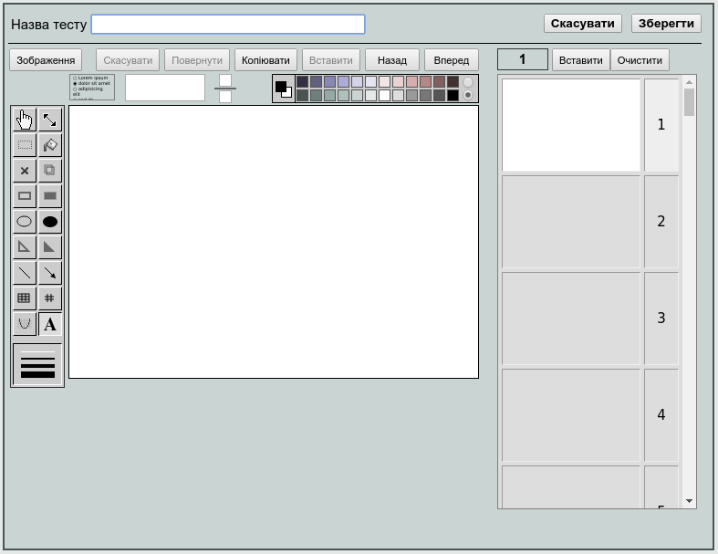
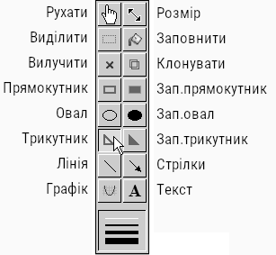
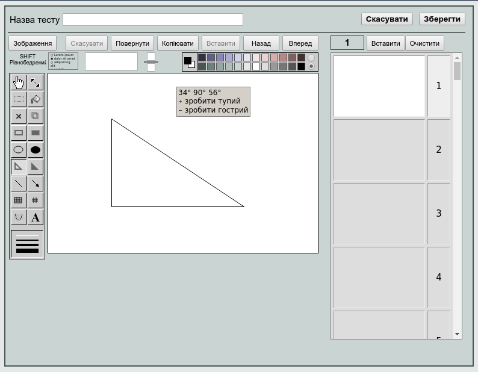
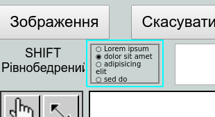
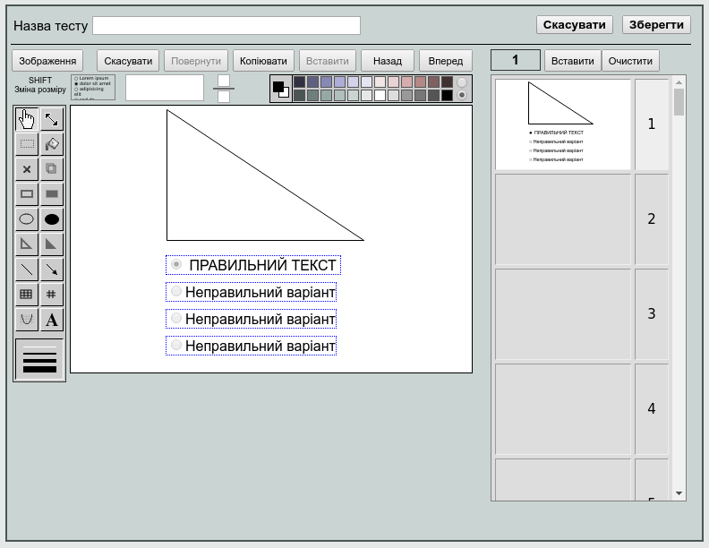
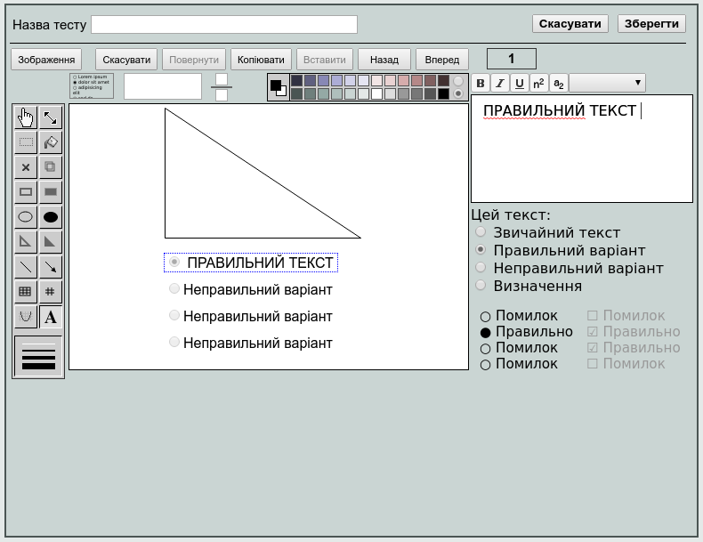
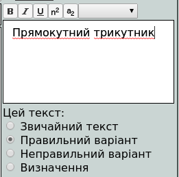
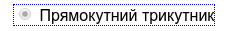
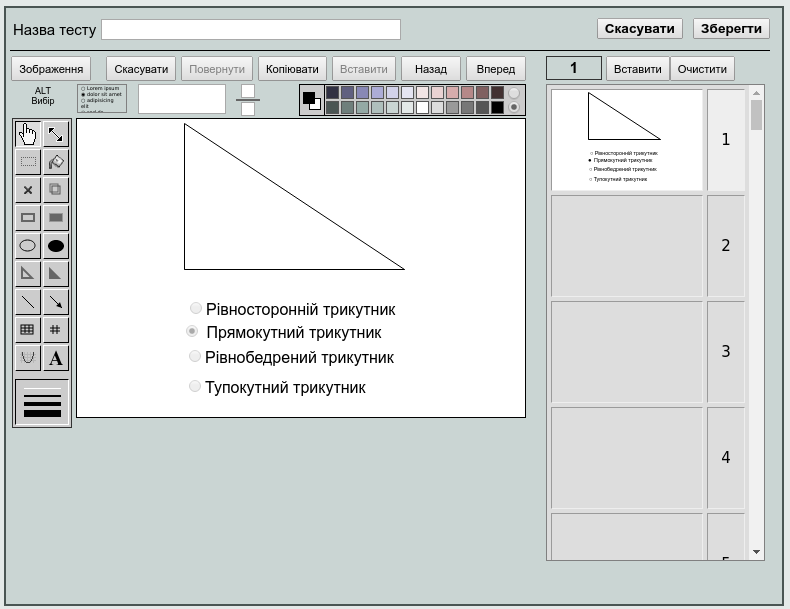
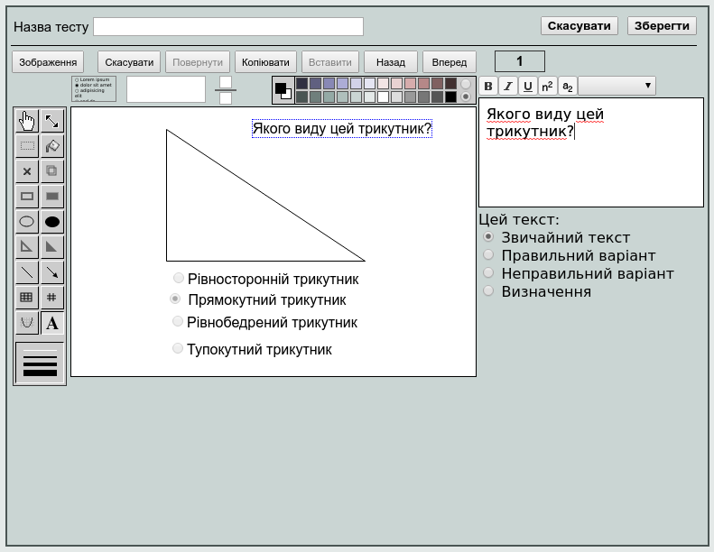
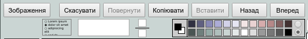
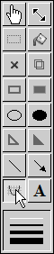
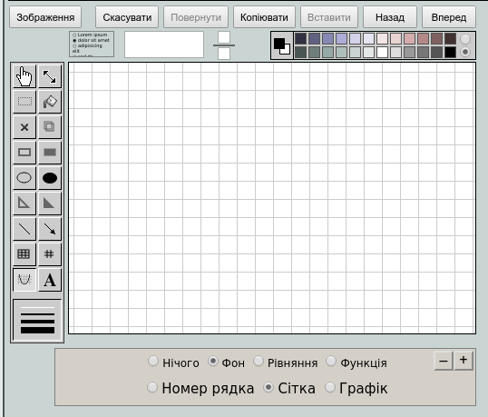
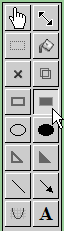
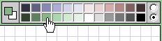
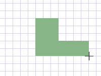
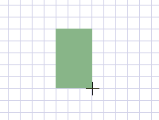
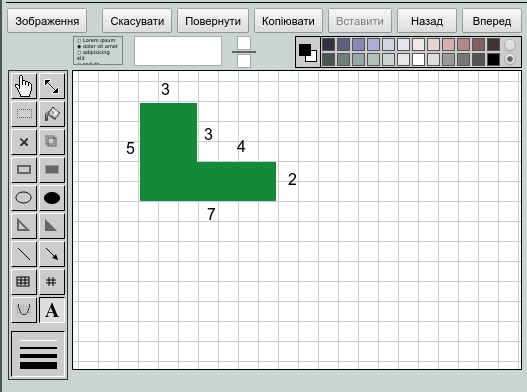
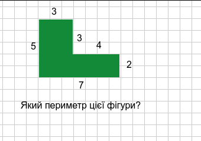
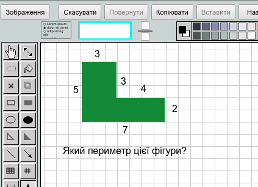
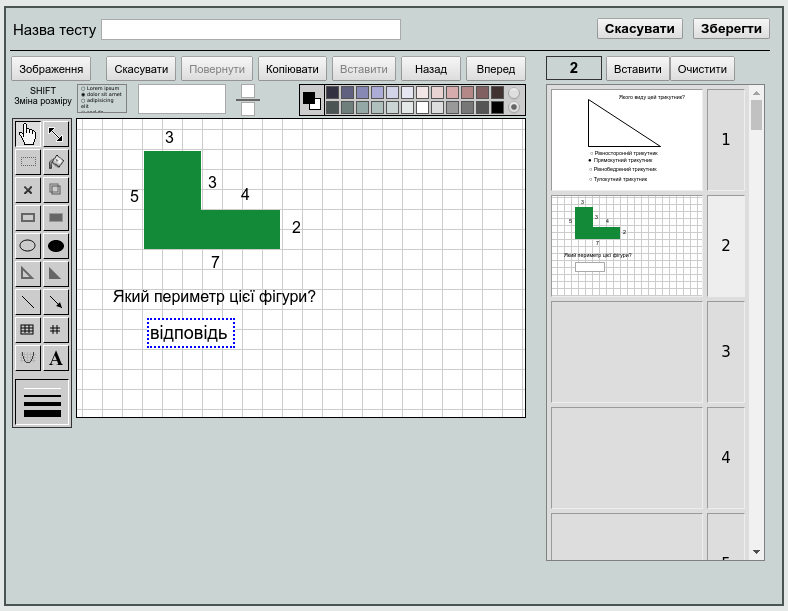
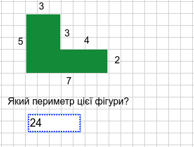
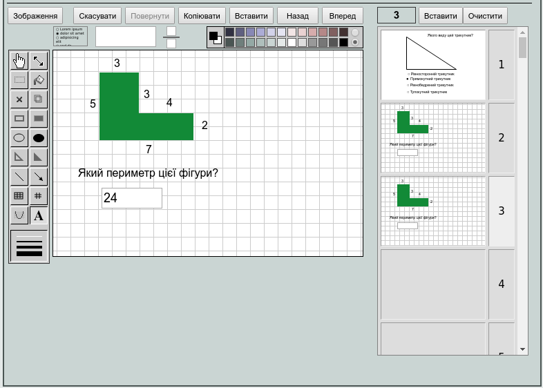
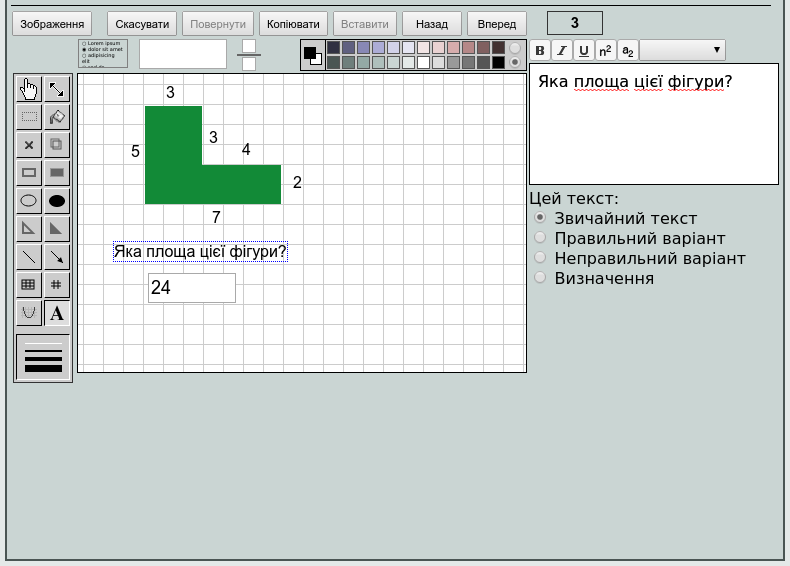
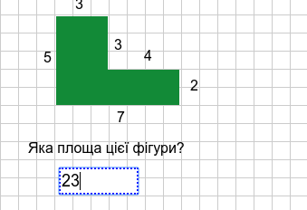
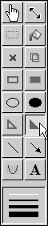
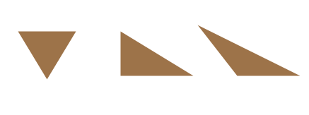
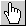

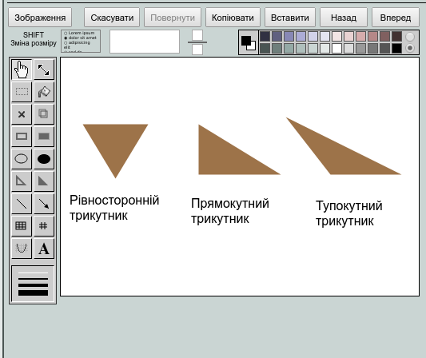
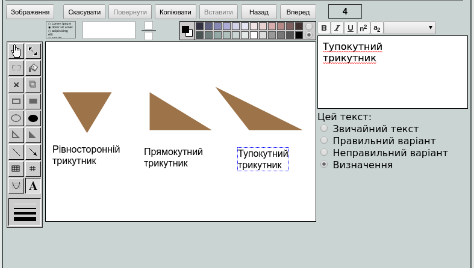
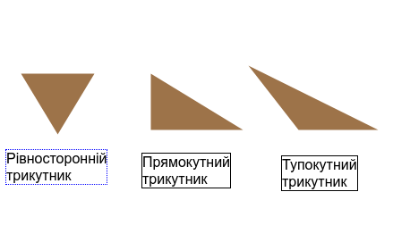
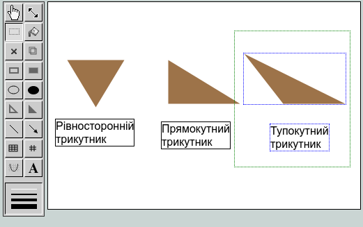
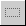
