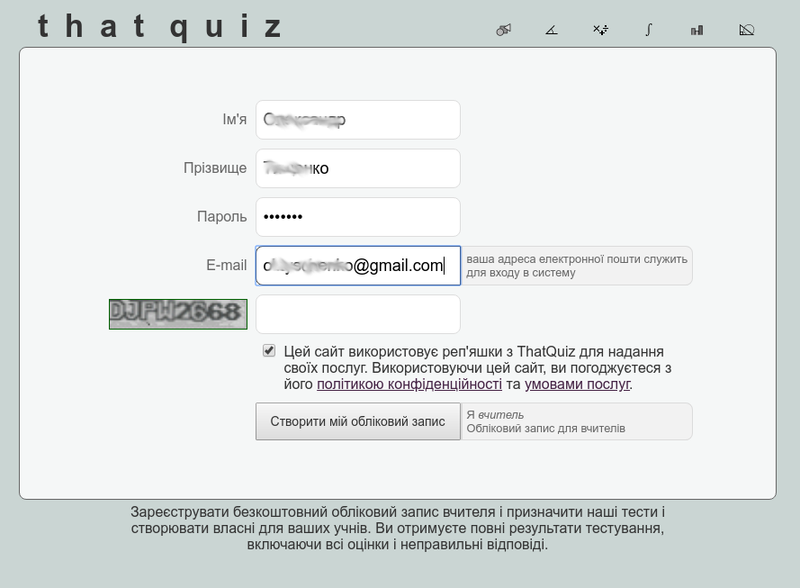
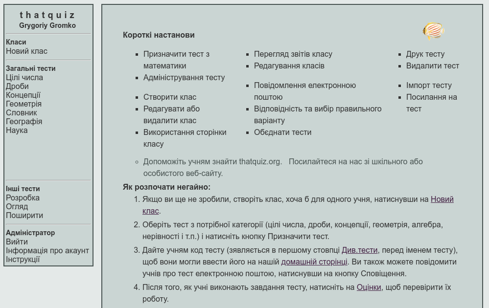
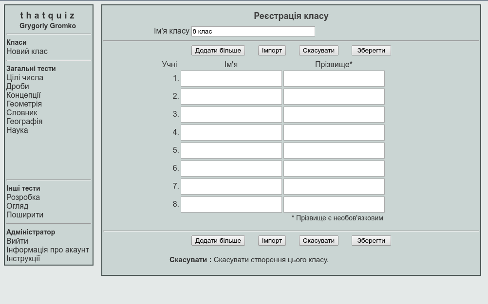
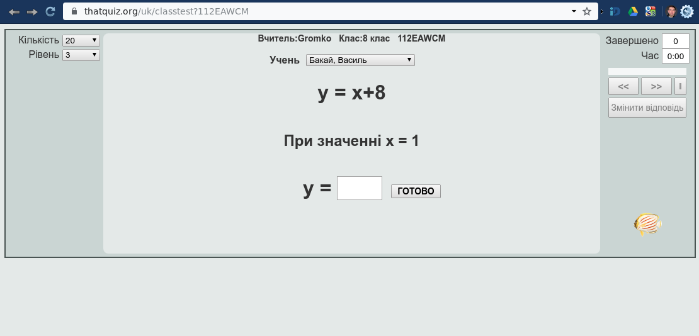
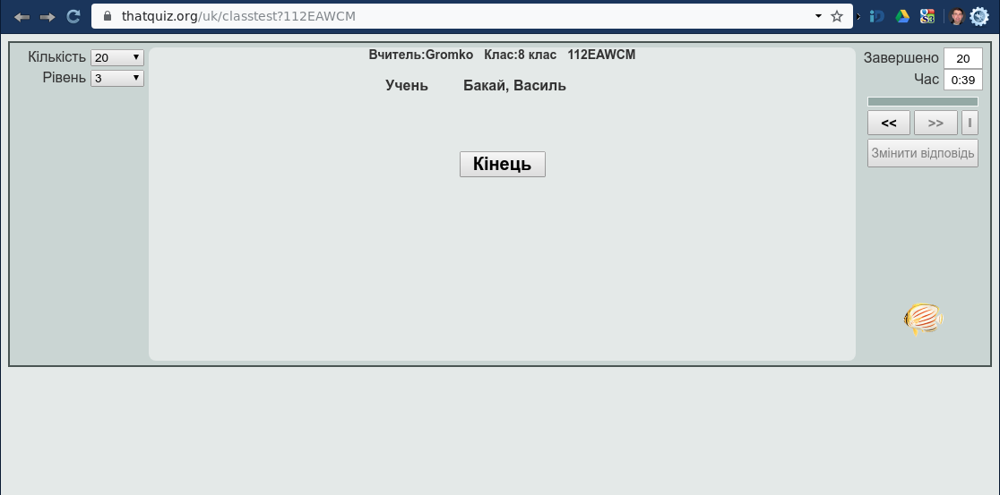
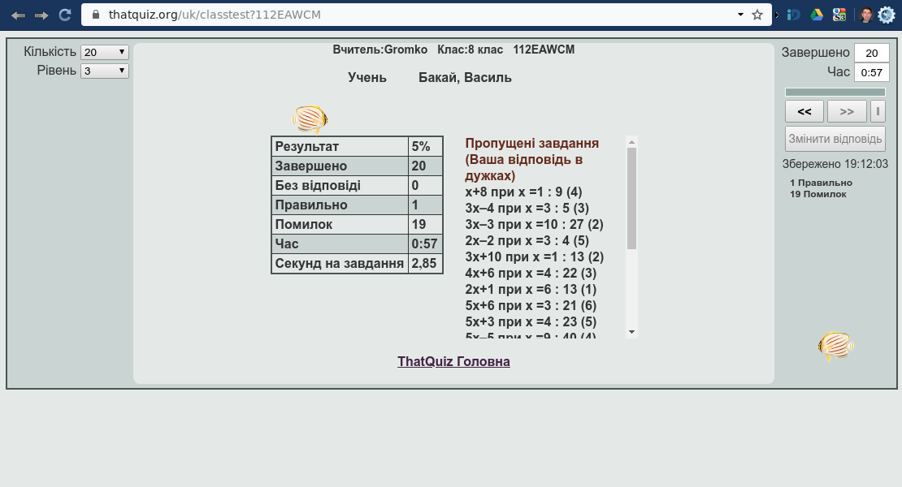
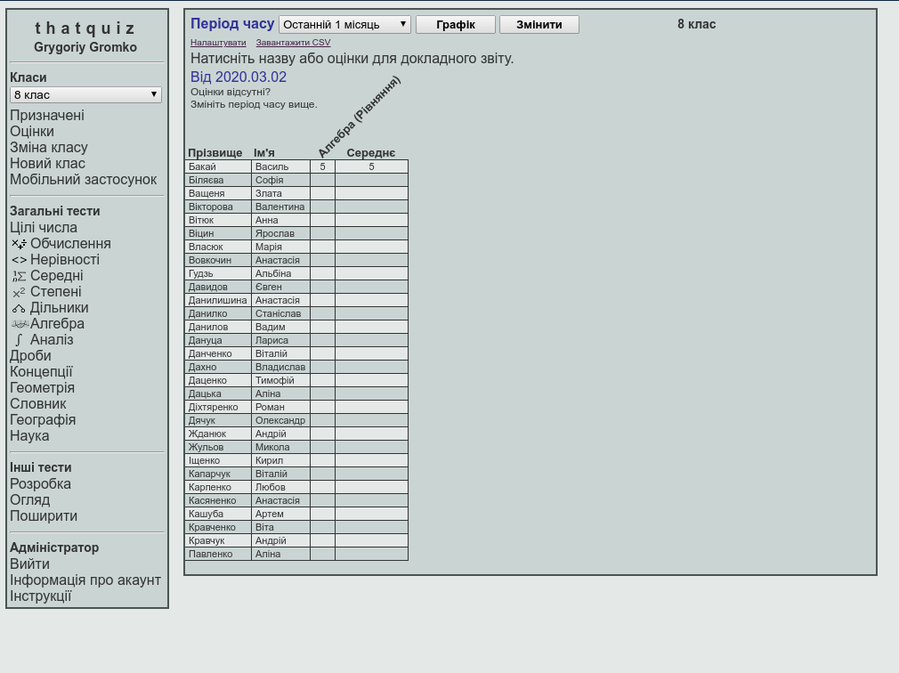
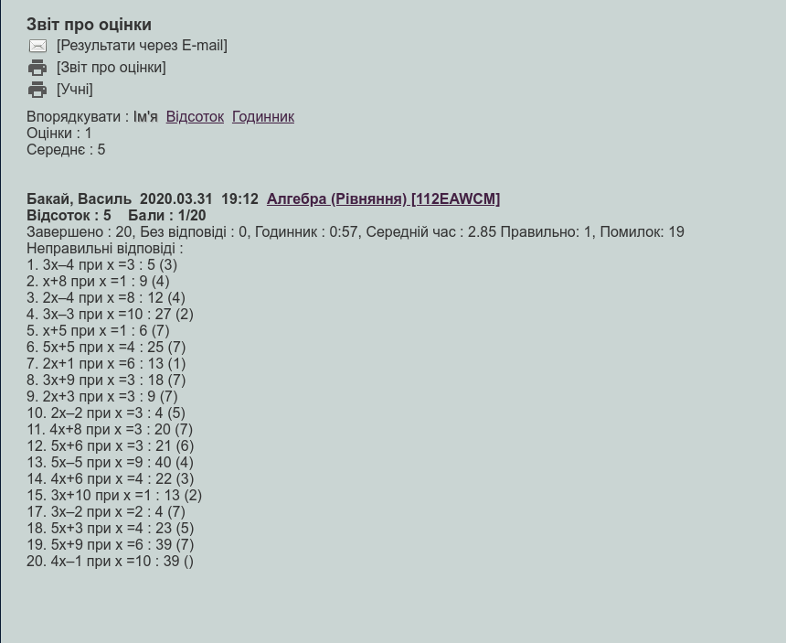

========
Починаємо працювати з ThatQuiz
========
ThatQuiz є безкоштовним сервісом для вчителів щоб проводити тестування як в класах, так і вдома. Учням можуть бути запропоновані питання з вибором правильної відповіді або на встановлення відповідності. Всі оцінки негайно повідомляються учням. Вчителі отримують повний перелік результатів випробувань для всіх класів, включаючи і неправильні відповіді.

Як розпочати негайно
--------------------
Знайдіть у веб-оглядачі за допомогою улюбленої пошукової системи "thatquiz" або перейдіть за адресою https://www.thatquiz.org

.. image:: tq1.png
   :width: 200pt
   
Ви можете обрати потрібну мову з меню, яке розташоване нижче переліку тестів.
Якщо ви бажаєте відразу мати українську мову, тоді варто заходити за посиланням: https://www.thatquiz.org/uk/

Реєстрація вчителя
------------------
ThatQuiz дає змогу працювати без жодної реєстрації як вчителя, так і учнів - у так званому режимі "практики", коли користувач самостійно обирає потрібний тест із наявних у Головному меню тестів, але у цьому режимі оцінювання не проводиться і оцінки не обліковуються. Реєстрація вчителя дає йому змогу:
- створювати клас;

- призначати тести;

- переглядати оцінки та протоколи тестування;

- розробляти власні тести;

- використовувати тести, розроблені іншими вчителями у ThatQuiz;

- поширювати власноруч розроблені тести серед інших вчителів;

- сповіщати батьків про оцінки учнів.

Реєстрація є безкоштовною і досить простою. Для реєстрації необхідно перейти за посиланням ``реєстрація``:

.. image:: tq4.png
   :width: 200pt

У вікні реєстрації запишіть необіхідні відомості про себе, адресу чинної електронної поштової скриньки та пароль для входу на сайт ThatQuiz. З метою запобігання автоматичним реєстраціям онлайн-ботів використовується CAPTCHA - потрібно ввести текст із зображення. Не забудьте погодитись на Умови надання послуг сайтом:

Після реєстрації та входу ви потрапляєте до Сторінки керування "ThatQuiz для вчителів", де вам буде запропонавано короткі настанови та поради для роботи з системою і меню з переліком доступних дій:
- меню Класи;

- меню Тести;

- меню Інші тести;

- меню Адміністратора.

Створення класу
---------------
Клас в ThatQuiz - група користувачів, яким надаються відповідні спільні тестові завдання і які мають спільний "електронний журнал" для оцінювання. Для створення класу (навіть для одного учня) натисніть ``Новий клас`` в меню Класи.

   
Запишіть назву класу та занесіть відомості про учнів. Якщо ви маєте готовий список учнів класу, то можете скористатися функцією ``Імпорт``, зкопіювавши список з текстового редактора і вставивши у вікно імпокту:

.. image:: tq9.png
   :width: 200pt
   
Обравши потрібне представлення даних учня та натиснувши кнопку ``Імпорт``, ви отримаєте готовий список учнів класу, який необхідно зберегти, натиснувши кнопу ``Зберегти``

.. image:: tq10.png
   :width: 200pt
   
Звичайно, ви можете створити список і "вручну", записавши небхідні відомості про учнів.
Ви завжди можете додати учня до списку, скориставшись кнопкою ``Додати більше``. Для вилучення учні зі списку необхідно видалити всі дані про нього, залишивши порожній рядок, після збереження списку, цей рядок буде вилучено.

Призначення тесту
-----------------
Натисніть потрібну тестову групу в Єдиному меню тестів (математичних - цілі числа, дроби, концепції, геометрія, алгебра, нерівності і т.п.). Налаштуйте параметри тестування за бажанням. Виберіть клас для проведення тесту в меню класів і натисніть кнопку ``Призначення тесту``, щоб закінчити.
Параметри тестів:
1. Кількість - це кількість завдань у тесті.

2. Рівень - ступінь складності тесту, від легкого (малі числа) до складного (великі числа).

3. Таймер - час за який учні повинні пройти тест.

4. Порядок- показує, як питання пропонуються кожному учню. Учні можуть отримувати питання у випадковому або фіксованому порядку.

.. image:: tq11.png
   :width: 200pt
   
Кнопка ``Регенерувати`` змінює пропоновані завдання. При призначенні тестів вчителем учням пропонується набір наперед визначених завдань - усім однакові, але  можливо у різному порядку. Це робиться для того, щоб можна було адекватно оцінити знання та навички учнів.
Можна змінити назву тесту або залишити її запропонованою, та визначити коли подавати тест для виконання учнями.
Створені тести можна завжди переглянути у розділі ``Призначені`

.. image:: tq12.png
   :width: 200pt

Код тесту
---------
Код тесту відображається в першому стовпчику таблиці тестів при натисканні на ``Призначені``. Він складається з 8 символів (цифр і букв, наприклад 112EWACM). Цей код використовується для організації доступу учнів до призначених для них завдань. Кожен тест має свій унікальний код. При роботі в класі можна запропонувати учням ввести код в поле Код тесту на домашній сторінці ThatQuiz і натиснути клавішу Enter щоб почати тестування - кдо можна записати на класній дошці, часто це найпростіший і найбільш доречний спосіб.
ThatQuiz  надає можливість повідомити учнів про тест електронною поштою, натиснувши на кнопку ``Сповіщення``.

.. image:: tq13.png
   :width: 200pt
   
Адреси електронної пошти учнів (батьків, чи осіб, які їх замінюють для дітей, які не досягли 14 років) можуть бути введені при реєстрації класу, при зміні списку учнів або при самому сповіщенні (адреси потрібно вводити всього лише один раз, вони запам'ятовуються автоматично).
Крім входу за допомогою тестового коду, можна здійснити вхід за допомогою посилання на тест або вбудувавши тест у код сайту чи блогу.

Виконання тесту учнями
-------------------------------
Щоб почати тестування, учні повинні або увійти через тестовий код, або через посилання на їх Головній сторінці класу, або через повідомлення електронною поштою.
Відразу після входу учень повинен обрати свої прізвище та ім'я зі списку класу. Для учнів реєстрація непотрібна.

.. image:: tq14.png
   :width: 200pt
   

   
До закінчення тесту учень завжди може повернутися до будь-якого з попередніх завдань і виправити відповідь. Натиснувши кнопку ``Кінець``, учень надсилає відповіді вчителю.

   
По закінченню тесту учню надається інформація про хід його виконання.

   
Перегляд результатів тестування
-------------------------------
Вчитель у будь-який момент може переглянути результати виконання тесту учнями, натиснувши кнопку ``Оцінки``

Обравши конкретного учня зі списку можна отримати детальний протокол тестування, у якому вказано час виконання тесту, допущені учнем помилки та оцінку за тест.

   
 ThatQuiz дає можливість вчителю обирати власну або пропоновану шкалу оцінювання (1-5, 1-7, 1-10, 1-20, 1-100), яку можна застосовувати як для окремих класів, так і для усіх класів вчителя.
 
 
.. image:: tq20.png
   :width: 200pt

Головна сторінка класу
----------------------
Натисніть на ``Редагувати клас`` в меню щоб побачити посилання на Головну сторінку класу. Кожен клас при реєстрації отримує свою сторінку, які автоматично присвоюється унікальний URL. Ви можете помістити цю сторінку в закладки компютерів в компютерному класі школи, передати посиланням електронною поштою для ваших учнів, або розмістити посилання на вашому веб-сайті школи. Ви можете змінити цю сторінку щоб включити свій власний текст або зображення класу. Домашня сторінка класу дозволяє кожному учню побачити список призначених тестів, які слід виконати. Якщо Ви публікуєте посилання на клас домашньої сторінки на загальнодоступному вебсайті, ми рекомендуємо використовувати вхід з паролем, в іншому випадку третя особа, хтось за межами класу, може відкрити сторінку і виконати тести, які були призначені для ваших учнів.

Повідомлення електронною поштою
-------------------------------
Якщо ви хочете відправити ваші учням сповіщення про тест - натисніть ``Призначені`` і позначте потрібний тест. До 10 тестів можуть бути позначені одночасно. Натисніть на кнопку ``Сповіщення`` і введіть адреси електронної пошти учнів, яким повідомлення повинно бути надіслано. ThatQuiz не використовуватиме ваші учнівські повідомлення електронної пошти для будь-яких цілей, крім повідомлення про тест за вашою вказівкою. При відправці повідомлення електронною поштою, кожен учень отримує посилання дійсне тільки для його/її тесту. Це може бути кращим, ніж вхід за допомогою тестового коду, тому що учню не потрібно шукати своє ім’я у списку класу щоб почати тестування. Для учнів які навчаються вдома, повідомлення електронній пошті є більш доцільним.

Створення класу
---------------
Щоб створити клас виберіть ``Новий клас`` в меню класів. Введіть назву класу, а також імена і прізвища всіх учнів в класі. Для того, щоб додати більше учнів натисніть кнопку Додати. Після завершення натисніть кнопку Зберегти. Новий клас тепер буде присутній в меню класів.

Редагування або видалення класу
-------------------------------
Для всіх операцій з класом, спочатку виберіть потрібний клас, використовуючи меню класів. Щоб змінити клас, натисніть кнопку ``Змінити клас`` в меню. Можуть бути додані учні і змінені їх імена. Для того, щоб видалити учня з класу, необхідно видалити його / імя і прізвище. Для того, щоб видалити весь клас, натисніть кнопку Видалити клас. Зверніть увагу, що всі оцінкии будуть також видалені, коли учні або клас буде видалений.

Посилання на тест
-----------------
Ви можете створити безпосереднє HTML-посилання на будь-який тест, використовуючи код тесту.
   http://www.thatquiz.org/uk/classtest?TESTCODE

TESTCODE є рядком з восьми символів (наприклад MPAK2835), його можна знайти в розділі ``Призначені``.

Імпорт тестів
-------------
Якщо інший учитель створив тест, який ви хочете використовувати, натисніть на ``Імпорт`` зі сторінки ``Огляд``. Введіть тестовий код тесту, який необхідно імпортувати - ви отримаєте свою власну копію цього тесту з новим тестовим кодом для вашого класу.

Крім того, ви можете імпортувати тести на відповідність і тести на вибір з бібліотеки публічного тестування, натиснувши кнопку Огляд в меню Інші тести.

Видалення тесту
---------------
Щоб видалити або скасувати тест, який був присвоєний клас, натисніть на ``Призначені`` в меню класів. Позначте тест, який буде видалений , і натисніть кнопку ``Видалити``.

Обєднання тестів
----------------
Тести можуть бути обєднані, щоб сформувати більший тест або іспит. Натисніть на ``Призначені`` в меню класів , щоб побачити повний список наявних тестів. Позначте потрібні тести, а потім натисніть на кнопку Обєднати - новий тест формується з питань з вказаних тестів. Новий тест може бути відредагований, клацнувши на його назву («Обєднаний тест»).

Тести на відповідність та вибір правильного
-------------------------------------------
У доповнення до наявних тестів, ви можете створити свій власний тест на знаходження відповідності або на вибір правильного варіанту відповіді. У розділі меню ``Інші тести`` натисніть ``Створити``, потім оберіть кнопку ``Відповідність`` або ``Вибір правильного``. Важливо памятати , що тести на відповідність та вибір правильної відповіді повинні бути призначені після того, як вони будуть створені. Призначення тесту створює копію з тестовим кодом для класу. Призначені копії незалежні від оригінального тесту який ви розробили. Видалення або зміна копій не впливає на нього. Якщо в подальшому ви вносите зміни в тест, ви повинні призначити його знову, щоб зміни стали доступними для учнів.

Друк тесту
----------
Зі сторінки ``Призначені`` або сторінки розробки оберіть тест, який ви хочете роздрукувати, а потім натисніть кнопку друку. Версія тесту для друку версія буде відкриватися в новому вікні або вкладці. Для того, щоб контролювати, де будуть розриви сторінок при друку, натисніть на роздільники між питаннями. Нарешті, ви повинні натиснути на посилання ``Друк`` або використати меню друку браузера для того, щоб відправити сторінку на принтер.

Перегляд звітів класу
---------------------
Звіт класу в меню класів показує всі оцінки для обраного класу. Кожен стовпець являє собою тест. Розміщення покажчика миші на колонці відображає інформацію про конкретниому тесту. Клацання на колонці, імя учня, або клас відкриває повний звіт класу для тесту або учня. Неправильні відповіді вказуються, відповідь учня завжди показано в круглих дужках.

Редагування оцінки
------------------
Для редагування оцінок спочатку клацніть по оцінкам в меню класів, щоб побачити всі оцінки. Якщо натиснути на окремій оцінку, ви можете побачити докладний звіт для цього класу, а також маєте можливість призначити інший рахунок для цього іспиту. Для того, щоб змінити клас на докладному звіті, натисніть на посилання ``змінити`` поруч з оцінкою, введіть нове числове значення, а потім натисніть клавішу Enter або натисніть кнопку ``Зберегти``.

Видалення оцінок дозволяє тестувати учнів ще раз. Натисніть на Оцінки в меню класів, а потім кнопку ``Змінити``. Натисніть на окремих оцінках, щоб вибрати їх для стирання. Натисніть на букву стовпця , щоб вибрати весь тест. Кнопка Очистити видалить всі оцінки, які були обрані.

Коли тест буде видалений з меню ``Призначені``, оцінки за нього також будуть автоматично видалені.

Авторські права та відмова від гарантій
---------------------------------------
ThatQuiz - безкоштовний сайт для використання в освітніх цілях.

Copyright © ThatQuiz. Цей онлайн-сервіс надано вам в надії, що він буде корисним для вас, але БЕЗ БУДЬ-ЯКИХ ГАРАНТІЙ; навіть без гарантій товарної придатності або придатності для певної мети.

